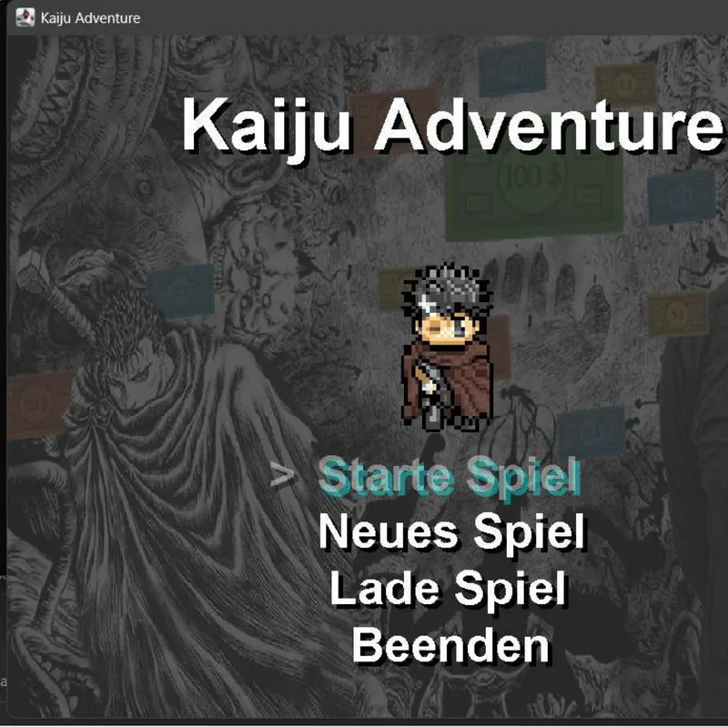
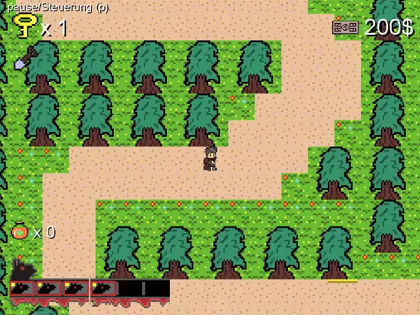

# Kaiju Adventure

A complete 2D action adventure in Java, built **without a game engine**: my own game loop, rendering, collision detection, tile-based world and save games.

Abitur (school-leaving) project, November–December 2022. The entire source code is mine; graphics and sound were made by my project team.

**[Project sheet with gameplay video →](https://my-website.abdilkarimb.workers.dev/en/projects/kaiju/)**

| Title screen | Gameplay |
| --- | --- |
|  |  |

## Play

**Windows, no installation:** open `release/KaijuAdventure/KaijuAdventure.exe`. The folder ships its own minimal Java runtime, so Java does not need to be installed.

**Any system with JDK 17+ and Maven:**

```bash
cd "Kaiju Adventure"
mvn package
java -jar target/KaijuAdventure.jar
```

### Controls

| Key | Action |
| --- | --- |
| `W` `A` `S` `D` | Move, navigate menus |
| `Enter` | Attack, talk, open, confirm |
| `E` | Drink a healing potion |
| `P` | Pause menu (resume, save, main menu) |
| `Delete` | Delete a save slot on the load screen |

## How it works

- **Game loop.** A dedicated thread keeps the game at 60 frames per second. Instead of fixed sleeps, a delta-time accumulator collects elapsed time and only updates and draws once a full frame interval has passed, so the game does not run faster on faster machines. Update and draw are separate steps.
- **Tile world.** The 80 × 80 world map lives as a text grid in `ressources/weltkarte/map2.txt` and is translated into 48 px tiles at startup (6,400 tiles).
- **Collision detection** against tiles, objects and units, including enemies and NPCs.
- **State machine** across eleven game states, from title screen and prologue through play, dialogue, shop and pause to the epilogue.
- **Save games** go to local files by default (`%APPDATA%/KaijuAdventure` on Windows, `~/.kaiju-adventure` elsewhere; override with `-Dkaiju.save.dir=…`). If a MySQL driver is on the classpath and a database is reachable, the game uses the original MySQL storage via JDBC instead; the schema is in `ressources/sql/Kaiju-Datenbank.txt`.
- **Packaging.** `build.ps1` builds the JAR with Maven, cuts a minimal Java runtime with `jlink` (`java.base`, `java.desktop`, `java.sql`) and bundles both into a Windows app with `jpackage`.


## Project layout

```
Kaiju Adventure/
  src/main/         game loop, input, collision, UI, sound, timer
  src/unit/         player, enemies, NPCs
  src/objekt/       items and world objects (keys, doors, chests …)
  src/surrounding/  tiles and the tile manager
  src/persistenz/   save-game storage (file backend)
  src/sql/          MySQL access
  ressources/       sprites, sounds, world map, database schema
  pom.xml           Maven build (Java 17)
build.ps1           JAR → jlink runtime → jpackage Windows app
release/            ready-to-run Windows build
```

29 classes, about 4,960 lines of Java.

## Known issues

My own review, four years later. It was my first larger piece of software, and this is how I read that code today:

- Database credentials are hard-coded in `src/sql/Interface.java` (a local `root` account without a password) instead of coming from a configuration.
- SQL statements are built by string concatenation instead of prepared statements with parameters.
- `src/main/UI.java` grew far too large at 1,106 lines.
- There are no automated tests.

## Credits

- **Code:** Abdil Karim Bakir
- **Graphics and sound:** the project team

## License

The code, the build script and the documentation are [MIT](LICENSE).

The artwork and sound in `Kaiju Adventure/ressources/` are **not**: they were
made by the project team and remain theirs (all rights reserved). They are
included so the game can be built and played. To reuse them in your own work,
ask the team.
